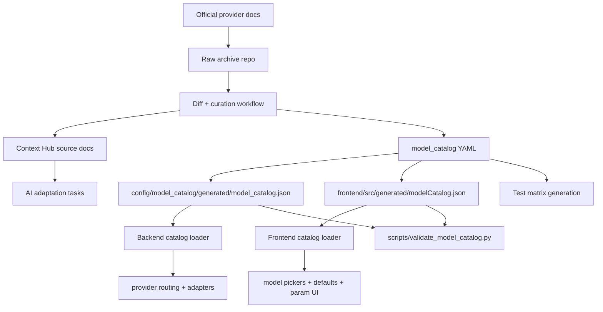

# LumenX Model Docs And Catalog Architecture Plan

> **For Claude:** REQUIRED SUB-SKILL: Use superpowers:executing-plans to implement this plan task-by-task.

**Goal:** Build a durable model-adaptation architecture for LumenX so official model docs can be archived, AI-friendly integration knowledge can be updated continuously, and model support in code can scale without scattered hardcoded defaults.

**Architecture:** Split the problem into three layers with strict ownership. Keep raw vendor docs in a separate archive repo as the auditable source of truth. Use Context Hub as the AI-facing knowledge layer that distills integration-critical details from those raw docs plus project-specific experience. Add a machine-readable `model_catalog` inside the LumenX repo as the executable source of truth for model families, versions, capabilities, provider routing, UI exposure, and test coverage.

**Tech Stack:** Independent markdown archive repo, `url-to-markdown` ingestion flow, Context Hub source packages, YAML/JSON model catalog, FastAPI, Pydantic, existing provider routing layer under `src/utils/`, Next.js/React frontend, pytest, Vitest.

---

## Why This Exists

LumenX is now in a zone where model churn is a product constraint, not a one-off maintenance task.

Current pressure points:

- Vendor models and DashScope proxy models evolve continuously.
- Official docs move faster than application code.
- Model lists, defaults, and capability assumptions are still partially duplicated across backend and frontend.
- The project already has a good provider routing foundation, but it still lacks one authoritative catalog for model support.

Today, the codebase already contains strong building blocks:

- Provider routing is centralized in [`src/utils/provider_registry.py`](/Users/hoshinoren/Documents/code/project/video_gen/gitlab/tron-comic/src/utils/provider_registry.py)
- Provider-specific media transport is centralized in [`src/utils/provider_media.py`](/Users/hoshinoren/Documents/code/project/video_gen/gitlab/tron-comic/src/utils/provider_media.py)
- Runtime model settings exist in [`src/apps/comic_gen/models.py`](/Users/hoshinoren/Documents/code/project/video_gen/gitlab/tron-comic/src/apps/comic_gen/models.py)

But model definitions are still fragmented:

- Frontend model lists are hardcoded in [`frontend/src/store/projectStore.ts`](/Users/hoshinoren/Documents/code/project/video_gen/gitlab/tron-comic/frontend/src/store/projectStore.ts)
- Default model values are duplicated in [`frontend/src/components/common/ModelSettingsModal.tsx`](/Users/hoshinoren/Documents/code/project/video_gen/gitlab/tron-comic/frontend/src/components/common/ModelSettingsModal.tsx), [`frontend/src/components/series/SeriesModelSettingsModal.tsx`](/Users/hoshinoren/Documents/code/project/video_gen/gitlab/tron-comic/frontend/src/components/series/SeriesModelSettingsModal.tsx), and [`frontend/src/components/modules/VideoGenerator.tsx`](/Users/hoshinoren/Documents/code/project/video_gen/gitlab/tron-comic/frontend/src/components/modules/VideoGenerator.tsx)
- Factory and adapter selection still encode model assumptions in multiple places, including [`src/models/factory.py`](/Users/hoshinoren/Documents/code/project/video_gen/gitlab/tron-comic/src/models/factory.py), [`src/models/image.py`](/Users/hoshinoren/Documents/code/project/video_gen/gitlab/tron-comic/src/models/image.py), and [`src/models/wanx.py`](/Users/hoshinoren/Documents/code/project/video_gen/gitlab/tron-comic/src/models/wanx.py)

This plan fixes that by turning model support into a first-class platform concern.

## Desired End State

When a new model version appears, the maintenance loop should look like this:

1. Capture the official docs into an auditable raw archive.
2. Distill integration-critical details into Context Hub docs for AI use.
3. Update one machine-readable `model_catalog`.
4. Regenerate or reload model metadata in backend and frontend.
5. Run targeted tests driven by the catalog.
6. Ship support without hunting for duplicated model strings across the codebase.

## Non-Goals

This plan does not attempt to:

- Replace official documentation with Context Hub.
- Auto-generate every adapter implementation from docs.
- Turn the first MVP into a full external plugin ecosystem.
- Solve all future model onboarding automation on day one.

The MVP should make model support structured and maintainable, not fully autonomous.

## Three-Layer Architecture

### Layer 1: Raw Document Archive

**Purpose:** Preserve official source material exactly enough for audit, diffing, and later re-interpretation.

**Repository recommendation:** separate private repo, for example `lumenx-vendor-docs`.

**Why separate from the main LumenX repo:**

- Vendor docs can be bulky, noisy, and frequently updated.
- Some docs may require auth, cookies, or regional access.
- The main app repo should not become a long-term raw content dump.

**Primary inputs:**

- Official API reference pages
- SDK docs
- OpenAPI or JSON payload examples
- Release notes
- Pricing and availability notes when relevant to integration behavior

**Ingestion mechanism:**

- Use the `url-to-markdown` skill as the default capture workflow for URL-based docs.
- Save the fetched markdown plus metadata and optional raw attachments.
- Treat this as an archival step, not as the final AI-facing doc.

**Recommended archive structure:**

```text
lumenx-vendor-docs/
  sources/
    aliyun/
      wan/
        2026-04-03/
          meta.json
          official.md
          release-note.md
          openapi.json
    kling/
      2026-04-03/
        meta.json
        official.md
    vidu/
      2026-04-03/
        meta.json
        official.md
    pixverse/
      2026-04-03/
        meta.json
        official.md
```

**Minimum metadata schema:**

```json
{
  "source_url": "https://example.com/api-reference",
  "provider": "aliyun",
  "model_family": "wan",
  "doc_type": "api-reference",
  "language": "zh-CN",
  "fetched_at": "2026-04-03T10:30:00Z",
  "release_date": "2026-03-30",
  "auth_required": false,
  "content_hash": "sha256:...",
  "notes": "Captured via url-to-markdown"
}
```

**Retention rule:**

- Never overwrite old snapshots.
- New capture creates a new dated folder.
- Diffing is done between snapshots, not by mutating a single canonical file.

### Layer 2: AI-Curated Integration Knowledge

**Purpose:** Give the coding agent the shortest path from vendor docs to implementation decisions.

**System recommendation:** Context Hub source package maintained by the LumenX team.

**Why this is a separate layer:**

- Raw docs are too noisy and inconsistent for repeated coding tasks.
- The project needs integration-focused summaries, not full document mirrors.
- Project-specific lessons must live somewhere durable and AI-friendly.

**What belongs here:**

- Auth rules
- Endpoint families
- Request and response shape
- Supported modalities
- Input transport constraints
- Region constraints
- Duration and resolution limits
- Known error patterns
- LumenX-specific compatibility notes

**What does not belong here:**

- Large raw HTML dumps
- Every single example from vendor docs
- Temporary debugging notes that are not yet validated

**Recommended Context Hub source structure:**

```text
lumenx-ai-context/
  aliyun/
    docs/
      wan-t2i/
        DOC.md
      wan-image/
        DOC.md
      wan-i2v-r2v/
        DOC.md
      bailian-kling-proxy/
        DOC.md
      bailian-vidu-proxy/
        DOC.md
  kling/
    docs/
      vendor-api/
        DOC.md
  vidu/
    docs/
      vendor-api/
        DOC.md
  pixverse/
    docs/
      vendor-api/
        DOC.md
  lumenx/
    docs/
      provider-routing-rules/
        DOC.md
      media-transport-rules/
        DOC.md
      model-adaptation-checklist/
        DOC.md
```

**Recommended document template:**

```markdown
# <Provider / Model Family>

## Snapshot
- Provider:
- Source snapshot:
- Last reviewed:
- Applicable model IDs:

## Auth
- Required keys:
- Region constraints:

## Supported operations
- t2i:
- i2i:
- i2v:
- r2v:

## Request contract
- Endpoint:
- Required fields:
- Optional fields:
- Input media constraints:

## Response contract
- Success payload:
- Async polling:
- Expiration behavior:

## LumenX integration notes
- Provider backend mode:
- Transport mapping:
- Known pitfalls:
- Tests to update:
```

**Role of local annotations:**

- Context Hub annotations remain useful for personal or machine-local notes.
- Team-critical knowledge must be promoted into the shared source docs, not left in local annotations only.

### Layer 3: Executable Model Catalog

**Purpose:** Make model support in LumenX data-driven and enforce a single source of truth for runtime behavior.

This is the most important new layer.

`model_catalog` should answer these questions:

- Which models does LumenX know about?
- Which models are active, recommended, deprecated, or experimental?
- Which capabilities does each model support?
- Which provider backends are allowed for this model family?
- Which credentials are required?
- Which UI surfaces should expose the model?
- Which defaults and parameter controls should be rendered?
- Which docs and tests are associated with the model?

If raw docs answer "what the vendor says", `model_catalog` answers "what LumenX supports".

## Why `model_catalog` Matters

Without it, model support remains spread across:

- backend routing logic
- frontend dropdown lists
- multiple duplicated default values
- tests with handwritten model matrices
- docs that drift away from actual supported behavior

With it, model support becomes:

- declarative
- testable
- diffable in PRs
- consumable by both Python and TypeScript
- easier to extend when models and providers change

This is not just a config file. It is a platform contract.

## Proposed `model_catalog` Structure

**Repository location:** inside the main LumenX repo.

**Recommended layout:**

```text
config/model_catalog/
  catalog.meta.yaml
  families/
    wan.yaml
    kling.yaml
    vidu.yaml
    pixverse.yaml
  schema/
    model-catalog.schema.json
  generated/
    model_catalog.json
```

**Authoring format:** YAML

**Runtime consumption format:** generated JSON

**Why this split:**

- YAML is easier for humans to review and edit.
- JSON is simpler to load from both Python and TypeScript.
- A schema allows strict validation before app code uses the catalog.

**Generated artifact policy:**

- `generated/model_catalog.json` should be committed to the repo in the MVP.
- `frontend/src/generated/modelCatalog.json` should be emitted from the same build step as a frontend-local mirror of the canonical JSON.
- Python should read `config/model_catalog/generated/model_catalog.json`.
- TypeScript should read the frontend-local generated mirror, not import repo-external files directly.
- Neither runtime should parse YAML independently.
- `scripts/validate_model_catalog.py` should be the human-readable verification entrypoint for artifact parity and default-surface safety.
- CI should rebuild the JSON and fail if the committed artifact is stale.
- This keeps runtime simple and avoids introducing YAML parsers into the frontend bundle.
- The frontend-local mirror avoids Next.js external-directory edge cases during static export builds while preserving one logical source of truth.

## Recommended Catalog Schema

Each model entry should contain at least:

```yaml
id: wan2.6-i2v
display_name: Wan 2.6 I2V
family: wan
provider: aliyun
status: active
release_stage: stable
capabilities:
  - i2v
supported_backends:
  - dashscope
default_backend: dashscope
backend_env_key: null
backend_model_ids:
  dashscope: wan2.6-i2v
inputs:
  image_ref:
    required: true
    transport: dashscope_image_to_video
  audio_ref:
    supported: true
    transport: dashscope_temp_file_url
  reference_video:
    supported: false
params:
  resolution:
    type: enum
    options: [480p, 720p, 1080p]
    default: 720p
  duration:
    type: slider
    min: 2
    max: 15
    step: 1
    default: 5
  seed:
    supported: true
  negative_prompt:
    supported: true
  shot_type:
    supported: true
ui:
  visible_in:
    - project_settings
    - series_settings
    - video_sidebar
  recommended: true
  order: 100
  badges:
    - latest
credentials:
  dashscope:
    - DASHSCOPE_API_KEY
docs:
  official_snapshot_ids:
    - aliyun/wan/2026-04-03
  context_hub_doc_ids:
    - aliyun/wan-i2v-r2v
tests:
  smoke:
    - tests/test_wanx_provider_media.py
  routing:
    - tests/test_provider_registry.py
deprecation:
  replaces: []
  replaced_by: []
```

For hybrid-provider families such as Kling:

```yaml
id: kling-v3
display_name: Kling v3
family: kling
provider: kling
status: active
release_stage: stable
capabilities:
  - t2v
  - i2v
supported_backends:
  - dashscope
  - vendor
default_backend: dashscope
backend_env_key: KLING_PROVIDER_MODE
backend_model_ids:
  dashscope: kling-v3
  vendor: kling-v3
inputs:
  image_ref:
    required: false
    transport_by_backend:
      dashscope: dashscope_image_to_video
      vendor: kling_vendor_base64_image
  audio_ref:
    supported: true
    transport_by_backend:
      dashscope: dashscope_temp_file_url
      vendor: kling_vendor_audio_url
credentials:
  dashscope:
    - DASHSCOPE_API_KEY
  vendor:
    - KLING_ACCESS_KEY
    - KLING_SECRET_KEY
docs:
  official_snapshot_ids:
    - kling/2026-04-03
  context_hub_doc_ids:
    - aliyun/bailian-kling-proxy
    - kling/vendor-api
```

## Ownership Rules

### Raw archive owns

- vendor wording
- raw examples
- dated snapshots
- source URLs
- audit trail

### Context Hub owns

- integration summaries
- AI-friendly structure
- project-specific implementation notes
- distilled limitations and error handling guidance

### `model_catalog` owns

- what LumenX exposes
- runtime defaults
- provider routing availability
- UI visibility
- parameter affordances
- supported credential sets
- docs linkage
- test linkage

## System Data Flow



## How This Fits The Current LumenX Codebase

### Existing code that should eventually consume the catalog

**Backend**

- [`src/utils/provider_registry.py`](/Users/hoshinoren/Documents/code/project/video_gen/gitlab/tron-comic/src/utils/provider_registry.py)
- [`src/utils/provider_media.py`](/Users/hoshinoren/Documents/code/project/video_gen/gitlab/tron-comic/src/utils/provider_media.py)
- [`src/models/factory.py`](/Users/hoshinoren/Documents/code/project/video_gen/gitlab/tron-comic/src/models/factory.py)
- [`src/models/image.py`](/Users/hoshinoren/Documents/code/project/video_gen/gitlab/tron-comic/src/models/image.py)
- [`src/models/wanx.py`](/Users/hoshinoren/Documents/code/project/video_gen/gitlab/tron-comic/src/models/wanx.py)
- [`src/apps/comic_gen/models.py`](/Users/hoshinoren/Documents/code/project/video_gen/gitlab/tron-comic/src/apps/comic_gen/models.py)

**Frontend**

- [`frontend/src/store/projectStore.ts`](/Users/hoshinoren/Documents/code/project/video_gen/gitlab/tron-comic/frontend/src/store/projectStore.ts)
- [`frontend/src/components/common/ModelSettingsModal.tsx`](/Users/hoshinoren/Documents/code/project/video_gen/gitlab/tron-comic/frontend/src/components/common/ModelSettingsModal.tsx)
- [`frontend/src/components/series/SeriesModelSettingsModal.tsx`](/Users/hoshinoren/Documents/code/project/video_gen/gitlab/tron-comic/frontend/src/components/series/SeriesModelSettingsModal.tsx)
- [`frontend/src/components/modules/VideoGenerator.tsx`](/Users/hoshinoren/Documents/code/project/video_gen/gitlab/tron-comic/frontend/src/components/modules/VideoGenerator.tsx)
- [`frontend/src/components/project/EnvConfigDialog.tsx`](/Users/hoshinoren/Documents/code/project/video_gen/gitlab/tron-comic/frontend/src/components/project/EnvConfigDialog.tsx)
- [`frontend/src/components/settings/SettingsPage.tsx`](/Users/hoshinoren/Documents/code/project/video_gen/gitlab/tron-comic/frontend/src/components/settings/SettingsPage.tsx)

## MVP Definition

The MVP should not try to solve everything. It should prove the architecture with the smallest useful slice.

### MVP goals

- Introduce a valid `model_catalog` format inside LumenX.
- Move the current active model definitions for Wan, Kling, Vidu, and Pixverse into the catalog.
- Generate one runtime JSON artifact from the YAML catalog.
- Generate a frontend-local JSON mirror from the same catalog build step.
- Load catalog data in backend and frontend helper layers.
- Remove the most obvious duplicated model defaults and model list definitions from the frontend.
- Add a repo-native onboarding workflow entry so model work has one visible process entrypoint.
- Add a validation/report script so onboarding work is observable and reviewable.
- Remove the duplicated backend default model definitions that still live in `ModelSettings`.
- Keep existing provider routing behavior intact while making future extension easier.
- Establish doc linkage fields in the catalog without yet automating remote sync.

### MVP non-goals

- Auto-sync Context Hub from the raw archive repo.
- Dynamic plugin loading for arbitrary unknown providers.
- Full runtime database persistence of catalog state.
- Full Pixverse execution support if the underlying adapter path is not yet implemented. In the MVP, Pixverse may exist in the catalog as a hidden or non-default family entry for routing and doc readiness.
- Full elimination of every hardcoded model string in one pass.

## MVP File Plan

### New files in the LumenX repo

- Create: [`config/model_catalog/catalog.meta.yaml`](/Users/hoshinoren/Documents/code/project/video_gen/gitlab/tron-comic/config/model_catalog/catalog.meta.yaml)
- Create: [`config/model_catalog/families/wan.yaml`](/Users/hoshinoren/Documents/code/project/video_gen/gitlab/tron-comic/config/model_catalog/families/wan.yaml)
- Create: [`config/model_catalog/families/kling.yaml`](/Users/hoshinoren/Documents/code/project/video_gen/gitlab/tron-comic/config/model_catalog/families/kling.yaml)
- Create: [`config/model_catalog/families/vidu.yaml`](/Users/hoshinoren/Documents/code/project/video_gen/gitlab/tron-comic/config/model_catalog/families/vidu.yaml)
- Create: [`config/model_catalog/families/pixverse.yaml`](/Users/hoshinoren/Documents/code/project/video_gen/gitlab/tron-comic/config/model_catalog/families/pixverse.yaml)
- Create: [`config/model_catalog/schema/model-catalog.schema.json`](/Users/hoshinoren/Documents/code/project/video_gen/gitlab/tron-comic/config/model_catalog/schema/model-catalog.schema.json)
- Create: [`scripts/build_model_catalog.py`](/Users/hoshinoren/Documents/code/project/video_gen/gitlab/tron-comic/scripts/build_model_catalog.py)
- Create: [`src/utils/model_catalog.py`](/Users/hoshinoren/Documents/code/project/video_gen/gitlab/tron-comic/src/utils/model_catalog.py)
- Create: [`frontend/src/lib/modelCatalog.ts`](/Users/hoshinoren/Documents/code/project/video_gen/gitlab/tron-comic/frontend/src/lib/modelCatalog.ts)
- Create: [`tests/test_model_catalog.py`](/Users/hoshinoren/Documents/code/project/video_gen/gitlab/tron-comic/tests/test_model_catalog.py)
- Create: [`frontend/src/__tests__/model-catalog.test.ts`](/Users/hoshinoren/Documents/code/project/video_gen/gitlab/tron-comic/frontend/src/__tests__/model-catalog.test.ts)

### Existing files to modify in the MVP

- Modify: [`src/utils/provider_registry.py`](/Users/hoshinoren/Documents/code/project/video_gen/gitlab/tron-comic/src/utils/provider_registry.py)
- Modify: [`src/apps/comic_gen/models.py`](/Users/hoshinoren/Documents/code/project/video_gen/gitlab/tron-comic/src/apps/comic_gen/models.py)
- Modify: [`frontend/src/store/projectStore.ts`](/Users/hoshinoren/Documents/code/project/video_gen/gitlab/tron-comic/frontend/src/store/projectStore.ts)
- Modify: [`frontend/src/components/common/ModelSettingsModal.tsx`](/Users/hoshinoren/Documents/code/project/video_gen/gitlab/tron-comic/frontend/src/components/common/ModelSettingsModal.tsx)
- Modify: [`frontend/src/components/series/SeriesModelSettingsModal.tsx`](/Users/hoshinoren/Documents/code/project/video_gen/gitlab/tron-comic/frontend/src/components/series/SeriesModelSettingsModal.tsx)
- Modify: [`frontend/src/components/modules/VideoGenerator.tsx`](/Users/hoshinoren/Documents/code/project/video_gen/gitlab/tron-comic/frontend/src/components/modules/VideoGenerator.tsx)
- Modify: [`frontend/src/components/settings/SettingsPage.tsx`](/Users/hoshinoren/Documents/code/project/video_gen/gitlab/tron-comic/frontend/src/components/settings/SettingsPage.tsx)
- Modify: [`README.md`](/Users/hoshinoren/Documents/code/project/video_gen/gitlab/tron-comic/README.md)
- Modify: [`README_EN.md`](/Users/hoshinoren/Documents/code/project/video_gen/gitlab/tron-comic/README_EN.md)

## Migration Strategy

### Phase 0: Document only

- Finalize this architecture.
- Confirm ownership boundaries.
- Lock the MVP scope.

### Phase 1: Introduce catalog without changing behavior

- Add YAML source files and JSON generator.
- Add schema validation and tests.
- Add Python loader and TypeScript loader.
- Make no user-visible model behavior changes yet.

### Phase 2: Make frontend lists catalog-driven

- Replace hardcoded model option arrays in `projectStore.ts`.
- Replace duplicated default strings in settings dialogs.
- Keep UI output identical where possible.

### Phase 3: Make backend family config partially catalog-driven

- Load backend family definitions from catalog-derived data.
- Keep `provider_media.py` as the behavior engine, but feed it catalog-owned family metadata.

### Phase 4: Add doc workflow automation

- Add a repo-native model onboarding workflow inside this repository.
- Add a documented repo-only fallback path when the external raw-doc archive or Context Hub source repo is unavailable.
- Keep raw-doc ingestion scripts and archive-repo diff automation as the next cross-repo step, not a blocker for the repo-local workflow.

## Edge Cases And Policy Decisions

### Unknown model ID

- Backend should reject unknown IDs clearly.
- Frontend should not silently persist unknown IDs except during migration compatibility windows.

### Saved projects with legacy model IDs

- If a stored model ID is no longer present in the catalog, the app should load the project successfully and fall back to the family default or a declared replacement model.
- The fallback should be explicit in logs so catalog drift is visible during testing.

### Deprecated model

- Catalog should keep deprecated models as visible only when needed for backward compatibility.
- UI can mark them deprecated, but existing projects should continue to load.

### Backend routing mismatch

- A model cannot advertise vendor mode in the catalog unless credential fields and transport mappings are declared.

### Doc freshness mismatch

- The catalog should contain a `docs` revision pointer, but runtime behavior must not depend on live network doc availability.

### Region-specific behavior

- Region availability belongs in the docs and optional catalog metadata, but should not block MVP runtime support unless the app actively validates regions.

## Testing Strategy

### Catalog validation tests

- YAML files conform to schema.
- Generated JSON is stable and deterministic.
- Every model ID is unique.
- Every visible model has at least one associated doc pointer.

### Backend tests

- Provider family mapping is generated correctly from catalog entries.
- Backend defaults remain compatible with current routing behavior.
- Unknown or malformed catalog entries fail fast.

### Frontend tests

- Model selectors render from catalog data.
- Legacy defaults resolve to catalog defaults.
- Parameter UI generation remains correct for Wan, Kling, and Vidu current models.

### Regression safety

- Existing routing tests remain authoritative for provider behavior.
- Catalog integration must not change successful current test outcomes.

## Risks And Mitigations

### Risk: catalog becomes another duplicated source of truth

**Mitigation:** move model lists and defaults out of scattered frontend files in the MVP, not later.

### Risk: docs and catalog drift apart

**Mitigation:** require each catalog model family entry to point to both a raw snapshot ID and a Context Hub doc ID.

### Risk: catalog schema gets too ambitious

**Mitigation:** keep MVP fields limited to routing, UI visibility, params, credentials, docs, and tests.

### Risk: provider-specific quirks still leak into adapter code

**Mitigation:** allow adapter behavior to remain imperative, but make family metadata declarative first.

## Engineering Review Summary

After reviewing this plan against architecture, data flow, edge cases, testability, and migration safety, the MVP looks sound with three conditions:

1. The first implementation should treat `model_catalog` as additive, not as a big-bang rewrite.
2. Frontend defaults must be migrated early, because that is where the current duplication is highest.
3. Raw-doc automation should remain out of MVP, otherwise the scope expands too fast and blocks the high-value catalog work.

If these three constraints are respected, the MVP is ready to implement.

---

### Task 1: Define the first catalog schema and source files

**Files:**
- Create: `/Users/hoshinoren/Documents/code/project/video_gen/gitlab/tron-comic/config/model_catalog/catalog.meta.yaml`
- Create: `/Users/hoshinoren/Documents/code/project/video_gen/gitlab/tron-comic/config/model_catalog/families/wan.yaml`
- Create: `/Users/hoshinoren/Documents/code/project/video_gen/gitlab/tron-comic/config/model_catalog/families/kling.yaml`
- Create: `/Users/hoshinoren/Documents/code/project/video_gen/gitlab/tron-comic/config/model_catalog/families/vidu.yaml`
- Create: `/Users/hoshinoren/Documents/code/project/video_gen/gitlab/tron-comic/config/model_catalog/families/pixverse.yaml`
- Create: `/Users/hoshinoren/Documents/code/project/video_gen/gitlab/tron-comic/config/model_catalog/schema/model-catalog.schema.json`
- Test: `/Users/hoshinoren/Documents/code/project/video_gen/gitlab/tron-comic/tests/test_model_catalog.py`

**Step 1: Write the failing tests**

Cover:

- schema validation succeeds for well-formed family files
- duplicate model IDs fail
- unsupported backend names fail
- every visible model has `docs.context_hub_doc_ids`

**Step 2: Run test to verify it fails**

Run: `pytest tests/test_model_catalog.py -q`
Expected: FAIL because catalog files and validator do not exist yet.

**Step 3: Write the schema and seed family files**

Seed the first entries for:

- Wan current T2I, I2I, I2V, R2V variants
- Kling current supported variants
- Vidu current supported variants
- Pixverse current placeholder family and active known variants if any

**Step 4: Run tests to verify they pass**

Run: `pytest tests/test_model_catalog.py -q`
Expected: PASS.

**Step 5: Commit**

```bash
git add /Users/hoshinoren/Documents/code/project/video_gen/gitlab/tron-comic/config/model_catalog /Users/hoshinoren/Documents/code/project/video_gen/gitlab/tron-comic/tests/test_model_catalog.py
git commit -m "feat(catalog): add initial model catalog schema and family sources"
```

### Task 2: Add a catalog build step and backend loader

**Files:**
- Create: `/Users/hoshinoren/Documents/code/project/video_gen/gitlab/tron-comic/scripts/build_model_catalog.py`
- Create: `/Users/hoshinoren/Documents/code/project/video_gen/gitlab/tron-comic/src/utils/model_catalog.py`
- Modify: `/Users/hoshinoren/Documents/code/project/video_gen/gitlab/tron-comic/src/utils/provider_registry.py`
- Modify: `/Users/hoshinoren/Documents/code/project/video_gen/gitlab/tron-comic/src/apps/comic_gen/models.py`
- Test: `/Users/hoshinoren/Documents/code/project/video_gen/gitlab/tron-comic/tests/test_model_catalog.py`

**Step 1: Write the failing tests**

Cover:

- YAML sources build into deterministic `generated/model_catalog.json`
- backend loader returns normalized family configs
- provider registry can consume catalog-derived family data without changing current routing behavior

**Step 2: Run test to verify it fails**

Run: `pytest tests/test_model_catalog.py -q`
Expected: FAIL because build and load pipeline is not implemented yet.

**Step 3: Implement the build and load path**

- generate normalized JSON
- add loader helpers for Python
- keep current provider behavior stable
- expose backend default model helpers so `ModelSettings` defaults come from catalog-derived values instead of scattered string literals

**Step 4: Run tests**

Run: `pytest tests/test_model_catalog.py tests/test_provider_registry.py -q`
Expected: PASS.

**Step 5: Commit**

```bash
git add /Users/hoshinoren/Documents/code/project/video_gen/gitlab/tron-comic/scripts/build_model_catalog.py /Users/hoshinoren/Documents/code/project/video_gen/gitlab/tron-comic/src/utils/model_catalog.py /Users/hoshinoren/Documents/code/project/video_gen/gitlab/tron-comic/src/utils/provider_registry.py /Users/hoshinoren/Documents/code/project/video_gen/gitlab/tron-comic/src/apps/comic_gen/models.py /Users/hoshinoren/Documents/code/project/video_gen/gitlab/tron-comic/tests/test_model_catalog.py
git commit -m "feat(catalog): add build pipeline and backend loader"
```

### Task 3: Make frontend model lists and defaults catalog-driven

**Files:**
- Create: `/Users/hoshinoren/Documents/code/project/video_gen/gitlab/tron-comic/frontend/src/lib/modelCatalog.ts`
- Modify: `/Users/hoshinoren/Documents/code/project/video_gen/gitlab/tron-comic/frontend/src/store/projectStore.ts`
- Modify: `/Users/hoshinoren/Documents/code/project/video_gen/gitlab/tron-comic/frontend/src/components/common/ModelSettingsModal.tsx`
- Modify: `/Users/hoshinoren/Documents/code/project/video_gen/gitlab/tron-comic/frontend/src/components/series/SeriesModelSettingsModal.tsx`
- Modify: `/Users/hoshinoren/Documents/code/project/video_gen/gitlab/tron-comic/frontend/src/components/modules/VideoGenerator.tsx`
- Modify: `/Users/hoshinoren/Documents/code/project/video_gen/gitlab/tron-comic/frontend/src/components/settings/SettingsPage.tsx`
- Test: `/Users/hoshinoren/Documents/code/project/video_gen/gitlab/tron-comic/frontend/src/__tests__/model-catalog.test.ts`

**Step 1: Write the failing tests**

Cover:

- T2I, I2I, and I2V lists are derived from catalog data
- current default models resolve from catalog defaults
- video generator default model matches the selected catalog default
- settings page defaults resolve from the same catalog source as project and series settings

**Step 2: Run the test to verify it fails**

Run: `cd frontend && npm run test -- --run`
Expected: FAIL on missing catalog loader and mismatched hardcoded defaults.

**Step 3: Implement the frontend loader**

- load the frontend-local generated catalog JSON into TypeScript-safe shapes
- derive dropdown models and default selections from it
- keep current UI labels intact unless catalog says otherwise
- keep legacy saved model IDs on a safe fallback path back to visible catalog defaults

**Step 4: Re-run frontend checks**

Run: `cd frontend && npm run typecheck`
Expected: PASS.

Run: `cd frontend && npm run test -- --run`
Expected: PASS.

**Step 5: Commit**

```bash
git add /Users/hoshinoren/Documents/code/project/video_gen/gitlab/tron-comic/frontend/src/lib/modelCatalog.ts /Users/hoshinoren/Documents/code/project/video_gen/gitlab/tron-comic/frontend/src/store/projectStore.ts /Users/hoshinoren/Documents/code/project/video_gen/gitlab/tron-comic/frontend/src/components/common/ModelSettingsModal.tsx /Users/hoshinoren/Documents/code/project/video_gen/gitlab/tron-comic/frontend/src/components/series/SeriesModelSettingsModal.tsx /Users/hoshinoren/Documents/code/project/video_gen/gitlab/tron-comic/frontend/src/components/modules/VideoGenerator.tsx /Users/hoshinoren/Documents/code/project/video_gen/gitlab/tron-comic/frontend/src/components/settings/SettingsPage.tsx /Users/hoshinoren/Documents/code/project/video_gen/gitlab/tron-comic/frontend/src/__tests__/model-catalog.test.ts
git commit -m "feat(frontend): derive model options and defaults from catalog"
```

### Task 4: Document the doc pipeline and raw archive contract

**Files:**
- Modify: `/Users/hoshinoren/Documents/code/project/video_gen/gitlab/tron-comic/README.md`
- Modify: `/Users/hoshinoren/Documents/code/project/video_gen/gitlab/tron-comic/README_EN.md`
- Modify: `/Users/hoshinoren/Documents/code/project/video_gen/gitlab/tron-comic/CONTRIBUTING.md`
- Test: none

**Step 1: Add the workflow description**

Document:

- raw doc archive layer
- Context Hub layer
- `model_catalog` layer
- expected update order when a new model version appears

**Step 2: Add operator guidance**

Document that raw doc capture should use the `url-to-markdown` workflow and that catalog changes must include doc linkage.

**Step 3: Commit**

```bash
git add /Users/hoshinoren/Documents/code/project/video_gen/gitlab/tron-comic/README.md /Users/hoshinoren/Documents/code/project/video_gen/gitlab/tron-comic/README_EN.md /Users/hoshinoren/Documents/code/project/video_gen/gitlab/tron-comic/CONTRIBUTING.md
git commit -m "docs: define model doc pipeline and catalog workflow"
```

## MVP Exit Criteria

- A valid `model_catalog` exists in the repo and is schema-validated.
- Backend can load catalog data and keep current provider routing behavior unchanged.
- Frontend model lists and at least the main default model paths are catalog-driven.
- Catalog entries link to doc identifiers for Wan, Kling, Vidu, and Pixverse families.
- Test coverage exists for schema validation, loader behavior, and frontend default resolution.

## Recommendation

Implement the MVP now. The architecture is tight enough, the scope is bounded enough, and the current codebase already has the right routing foundations to support it.
